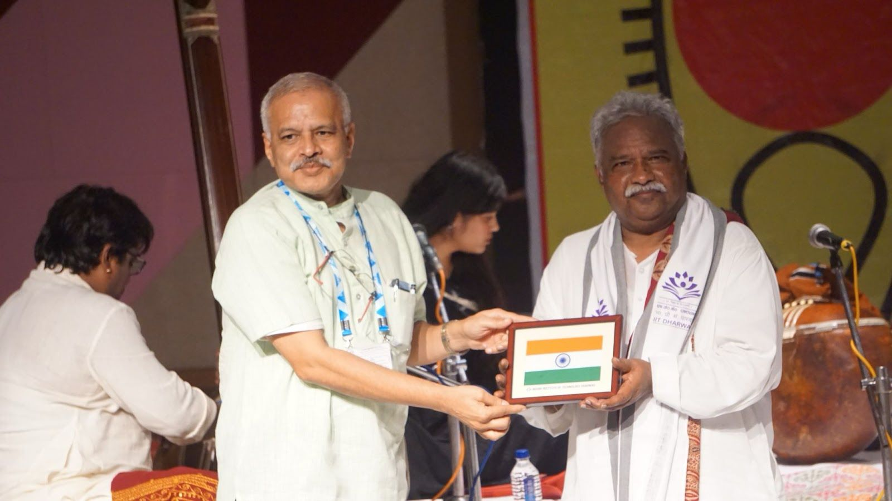

## SPICMACAY 
*—**the Society for the Promotion of Indian Classical Music and Culture amongst Youth**—is a non-political voluntary movement that organizes programs of classical music and dance, folk art, craft, yoga, classic cinema screenings, heritage walks, etc., inside school and college campuses throughout the country and the world to make students more aware of Indian and world heritage. This initiative makes education more holistic and meaningful as it highlights all that is abstract, subtle, inspiring, and mystical, teaching one to look within oneself. IIT Dharwad had the honor of hosting the SPIC MACAY REGIONAL CONVENTION, a 7-day cultural immersion program from 14th - 20th October, where students across Karnataka have come to celebrate the multicultural of Indian heritage.*

#### DAY 1 - MONDAY, October 14

***The commencement of SPICMACAY***

Kicking off an exciting week of events, the first gathering featured a special screening of the classic film **The Making of the Mahatma**. directed by the legendary **Shyam Benegal**. The film stars acclaimed actor **Shri Rajit Kapoor** as Mahatma Gandhi, bringing to life Gandhi's transformative 21 years in South Africa—a pivotal period in shaping his philosophy of non-violence and activism.

But the evening held an extraordinary surprise. Following the screening, the students had the incredible opportunity to interact directly with Rajit Kapoor himself. Known for his powerful portrayal, Kapoor won the Best Actor award for his role in this film. The interactive session allowed students to engage with him on his experience of embodying such an iconic figure, making it an unforgettable evening.

#### DAY 2 - TUESDAY, October 15

A melodious evening commenced with a Hindustani Vocal performance by Padma Shri awardee **Pt Venkatesh Kumar** accompanied by artists Shri Sridhar Mandre on Tabla and Shri Guruprasad Hegde on Harmonium. Pandit Venkatesh Kumar born in Lakshmipura in the Bellary region of northern Karnataka, who is best known for his rendition of devotional songs composed by Swami Hairdas and Kanakadasa. He belongs to the **Kirana and Gwalior Gharana**. The audience was enthralled by his euphonious performance.

#### DAY 3 - WEDNESDAY, October 16

**Tholpavakoothu**, a Kerala art form of puppetry was performed by the Padma Shri awardee **Shri K.K. Ramachandra Pulavar** accompanied by puppetry artists Shri Rajeev Pulavar, Shri Rajeev Pulavar, Shri Adithyan, Shri Prasad, Shri Vijay Krishna, and Shri Abhinav. He is famous for performing Tholpavakoothu, which was confined to temple art, as public performances, and even for addressing socio-political issues including HIV awareness and COVID-19 awareness. Ramachandra Pulavar was born into a family of puppet artists. At an early age, he learned puppetry lessons from his father and made his debut at Aryankav Bhagavathy temple in Kavalapara.

His performance brought the Ramayana to life, depicting iconic scenes such as Sita’s swayamvar, Rama’s vanvaas, Ravana’s abduction of Sita, the battle between Sugreev and Bali, and Rama’s victorious return to the throne. This impeccable and captivating presentation left the audience in awe.

Students not only enjoyed a culturally enriching evening but also gained valuable **exposure to the rich traditions of Indian storytelling** and craftsmanship. Experiencing such art forms firsthand deepens their understanding of India’s cultural heritage, fostering an appreciation for the timeless values and artistic expressions that shape the nation’s identity. This event provided a unique opportunity for students to connect with their roots in an engaging and meaningful way.

**The Team**

#### DAY- 4 THURSDAY, 17 OCT

The first event of the convention began with eager anticipation as **Ustad Shafique Khan** along with Shri Rajendra Nakod on the table, took the stage, settling into his performance with a beautifully tuned sitar. By the end, the audience erupted in applause, fully moved by the experience. It was an unforgettable evening celebrating the artistry of classical music.

Also, there was an Instructions session to the students of IIT Dharwad and the various participants from across Karnataka session about SPICMACAY by Ms. Supriti and her team.

The afternoon commenced with a lot of exciting workshops. The puppetry workshop began with a brief introduction to the **history and types of puppetry**. Tholpavakoothu, an ancient shadow puppetry art from Kerala, holds profound cultural and spiritual importance as a ritual offering, mainly performed in Devi temples. Based on the Kamba Ramayan, it features intricately carved animal-hide puppets and is uniquely set against a yellow backdrop created by traditional oil lamps. This sacred art form has been **preserved for decades** through its temple performances.

During the Dhrupad, participants learned a beautiful composition based on Raga Brindabani Sarang titled **'Dahan Lagyo Chandra Kiran**.

On the first day of the Bharatanatyam workshop, Mudras and Adavus were taught. **Mudras**, the hand gestures employed in Bharatanatyam, hold immense symbolic meaning, and play a vital role in storytelling. **Adavus** form the basic dance moves in Bharatanatyam. Any classical dance form depends upon the Adavus of that dance form.

The instructors of the Jazz workshop were friendly, creating an atmosphere of comfort and liveliness for the students to delve deep into to the world of Jazz. The students interacted a lot with the teachers about leaving no space for any distraction other than music.

In the Fado singing workshop, Ms Sonia taught one of the songs of Fado to all the participants.

The basics of Shruti and the Swarasthanas were taught during the Carnatic vocal workshop. R. N. Thygarajan also taught about **Talas**, how to put a Tala while varying the number of Aksharas in a beat (speeds). Small songs/parts of songs by various iconic composers were also taught.

In the F500+ auditorium, where all the shows took place, the event was inaugurated by the Dean SW Prof. Ramjee Repaka, Sangita Kala Acharya Vidwan R.N.Thyagarajan (Padma Shri awardee + Smt Divya Prabhu G.R.J, I.A.S. (DCLR Dharwad) and Prof. Shivaprasad Sonnada Math.

**The INAUGURAL SESSION OF SPICMACAY**

The most awaited session of the day was that of **Sangita Kalacharya Vidwan R.N.Thyagarajan** (Padma Shri awardee) who was accompanied by Vidushi Charulatha Ramanujam, on violin, Vidwan Tumkur B.Ravishankar on mridangam Vidwan B.Rajasekhar on morsing and on the tanpura was one of R. N. Thyagarajan's disciple. There was a **"jugalbandi"** between the mridangam and the morsing. Jugalbandi is a dialogue or a challenge of how closely one player can imitate what the other player played on their instrument. The fierce competition between the musicians during jugalbandi was so energetic which made the audience erupt in chaos and applause. R. N. Thyagarajan’s vocal singing accompanied by the violin was extremely melodious too.

#### DAY- 5 FRIDAY, 18 OCT

On the 5th day of the convention, activities began at the tranquil hour of 4 a.m., just before daybreak, with a revitalizing session of Naad Yoga—focused on tuning into the inner sounds—and Hatha Yoga, emphasizing postures and breath control to energize the nāḍīs. Naad Yog with **Pt. Nirmala Dey** for Naad Yog and **Vinayak Kulkarni** from Yogjyothi Kendra, Dharwad for Hatha Yog led the session, aiming to guide participants toward a balanced development of body, mind, and spirit, fostering perfect harmony with nature.

In the the intensive workshop for the Dhrupad, the teacher discussed the history, philosophy, and spiritual aspects of Dhrupad, providing context on its origins in the temples of India.

During his workshop, R. N. Thyagarajan and his disciple also helped the students reach the correct swarasthanas whenever they couldn’t. He also taught us 2 patriotic songs composed and sung during India's freedom struggle, one of which was the **national anthem of India**!

On the second day of the Bharatanatyam workshop, Mudras and Adavus of a song were taught. Vidushi Leela Samson also showed how words and sentences can be expressed using the Mudras to showcase the **intensity and strength of words**.

In a jazz workshop, a variety of instruments are typically present, each contributing unique textures to the ensemble. The instructors of the Jazz workshop taught Jazz songs exploring boundaries and helping them structure their ideas. Students were also given ask suggestions on how to approach interpreting well-known pieces in their own way.

On the 2nd day of Ms. Sonia workshop, the origins of Fado were told. There are two distinct styles of fado, **the older of which is associated with the city of Lisbon and the younger with the north-central Portuguese city of Coimbra**. Maria Severa, a tavern singer from Lisbon's Alfama district, is widely credited with popularizing fado in the 1830s and becoming the first renowned fadista, or fado singer. Accompanied by guitars, Severa sang about the hardships of life in a style that would come to define the Lisbon fado tradition: harmonically straightforward and deeply improvisational. 

The **various use of materials** like felt, fabric, yarn to make the puppets was talked about in the puppetry workshop. It was also discussed how puppets from ages ago are still preserved in the homes of the puppeteers, to save the heritage. Different types of animal skin are also used, like pig and donkey skin to create the puppets. The cleaned and furnished skin is imported all the way from Israel to India for making the puppets. 

In the afternoon, the students witnessed an energetic and uplifting performance by **Mr Lars Moller**, a Saxophone Jazz musician along with, Jonathan Furtado on the bass Guitar and Clifford Sequiera on the drums. The musicians showcased the the true essence and abstract thoughts that Jazz music can make a person feel. The performance ended with the audience giving a standing ovation to the artists. The mementos were presented to the artists by Vidushi Leela Samson. 

The next event was followed by **Ms Sonia Shirsat**, who performed Fado singing, a folk art from Goa and was accompanied by Carlos Manuel Francisco on guitar. She not only enchanted the audience with her singing but also showed her strong and deep vocals attained from years of practice. The artist also received a standing ovation for the concert.

The following show was that of **Shri Kaivalya Kumar Gurav** who performed Natya Sangeet & Marathi Abhangs with Shri Sridhar Mandre on table, Shri Guruprasad Hegde on harmonium, Shri Sukhad Munde on pakhawaj, Shri Samarth Patil on manjira. An **Abhang** is a unique style of singing that convey various stories in the Marathi language. Attendees thoroughly enjoyed the diversity and shift in the gears as we travelled to the realm of Marathi classical music. 

**Dhrupad** is one of the oldest styles of Hindustani music which is very melodic and well structured mixed with an uplifting and heroic theme. It is specifically performed only with Tanpura and Pakhawaj. The performance by **Shri Nirmalya Dey** with Shri Sukhad Munde on Pakhawaj and two others on Tanpuras moved the audience and brought about many surreal experiences. Voice is the only instrument, Pt Nirmalya Dey masterfully delivered and modulated it, bringing in the right feelings in the hearts of all listeners.

#### DAY- 6 SAT, 19 OCT 

The next morning, there were the 2nd morning sessions of Naad Yog and Hatha Yog.

This day was the final day for the intensive workshops. During the puppetry workshop, the participants dive into **creating their own puppets**. They were given sheets on which they drew the puppets and cut them out. Guided by the instructor, the particpants also learnt sewing, gluing, and crafting techniques.

The Dhrupad workshop covered rhythmic variations such as Dugun, Tigun, and Chaugun, offering a deep dive into the classical nuances of Dhrupad.
In the Carnatic workshop, a total of 6 songs were sung, of which 4 were selected to sing for the students presentation.

The dance practice of the Bharatanatyam song started in the previous workshop session was finished on this day. The workshop left a lasting impression on the students about the importance of dance in a person’s life and the exquisiteness of Indian classical dance.

The students in the Jazz workshop experienced an entertaining session where they performed the **fusion of Jazz with Indian music like Tabala and Tanpura**.

During her final workshop, Ms Sonia gave the book ‘Fado in the City’ to all her students. The book contained everything from the origins of Fado, the types and styles of Fado, to the instruments used in Fado and the most famous and reputed Fado singers.

Later in the evening, the participants presented the different art forms they practiced. Much to the surprise of everyone, they exceeded the expectations of every single person in the auditorium by showcasing their works.

There was also the Screening of Director Girish Kasaravalli’s film **‘Dweepa’**. Dweepa is a 2002 Indian Kannada-language film directed by Girish Kasaravalli and based on Na D'Souza's novel of the same title. Starring Soundarya, Avinash, and M. V. Vasudeva Rao in pivotal roles, the film addresses the pressing issue of dam construction and the resulting displacement of indigenous communities. Garnering critical acclaim, Dweepa received two National Film Awards, four Karnataka State Film Awards, and three Filmfare Awards South.

The first show of the day was by **Vidushi Leela Samson**, a Padma Shri awardee). She was accompanied by, Smt Purva Dhanashree Cotah for vocal support, Shri Dinesh Kumar on violin, Shri Karthikeyan on mridangam, Shri Harikrishnan for Nattuvangam. Bharatnatyam is an Indian classical dance form, presumably the oldest classical dance heritage of India, which is regarded as the mother of many other Indian classical dance forms. Before performing her three songs, Leela Samson explained the meanings of the songs for the audience to understand the depth of the art much better. The live music from accomplished players magnified the intricate movements of the dancer. The first and the last song performed focused on the **expressions and hands movements** of the art. The second song she performed focused on the **complex steps** of the art form. Finally, there was a q/a session between the audience and Leela Samson.

To bid adieu to the event, Ms. Supriti ended the event on a high note. She thanked the faculty of IIT Dharwad for their dedicated and genuine involvement in the event. She praised the different management teams (i.e. artist, stage, light, sound, green room, intensive workshop) who worked hard to bring this event to great heights. She called upon all the volunteers who worked day and night to make this event a success. She also acknowledged the workers who maintained the cleanliness and helped around all the events. After the event ended, there was a standing ovation and huge round of applause for the organising team and the participants and students themselves. It was an honor for IIT Dharwad to host such a remarkable event, where the rich tapestry of Indian culture came alive and is also one of the **first major cultural events hosted at the new IIT Dharwad campus**.

#### DAY 7 - SUNDAY, October 20

The 7th and the last day of the convention like all other days began early with the 4 a.m. enriching session of  Naad Yoga conducted by Nirmala Dey and Hatha yoga conducted by Vinayak Kulkarni.

After that students embarked on an exciting and insightful heritage tour, exploring the **historic town of Kittur, the homeland of the legendary Rani Chennamma, as well as the Gangubai Hangal and Pt. Mallikarjuna Mansur museums**. The grandeur of Kittur Fort captivated students, with its intriguing secret rooms, passages, and intricate stone-carved idols of deities like Saptamatrika and Gajalakshmi. Surrounded by lush greenery, the fort’s beauty left a lasting impression on all. The museums added to the excitement, offering a glimpse into history with their remarkable collections of war paintings, sculptures, traditional attire, and artifacts from the era. This immersive experience brought India’s rich heritage to life, leaving students inspired and deeply connected to the past.

**Some glimpses of the Heritage Tour**
 
                    *"There is no must in art because art is free"*-

                                                  Wassily Kandinsky

                                                    

